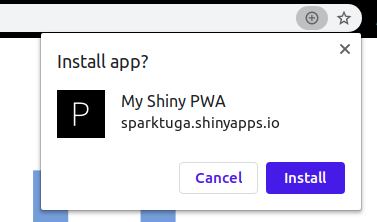
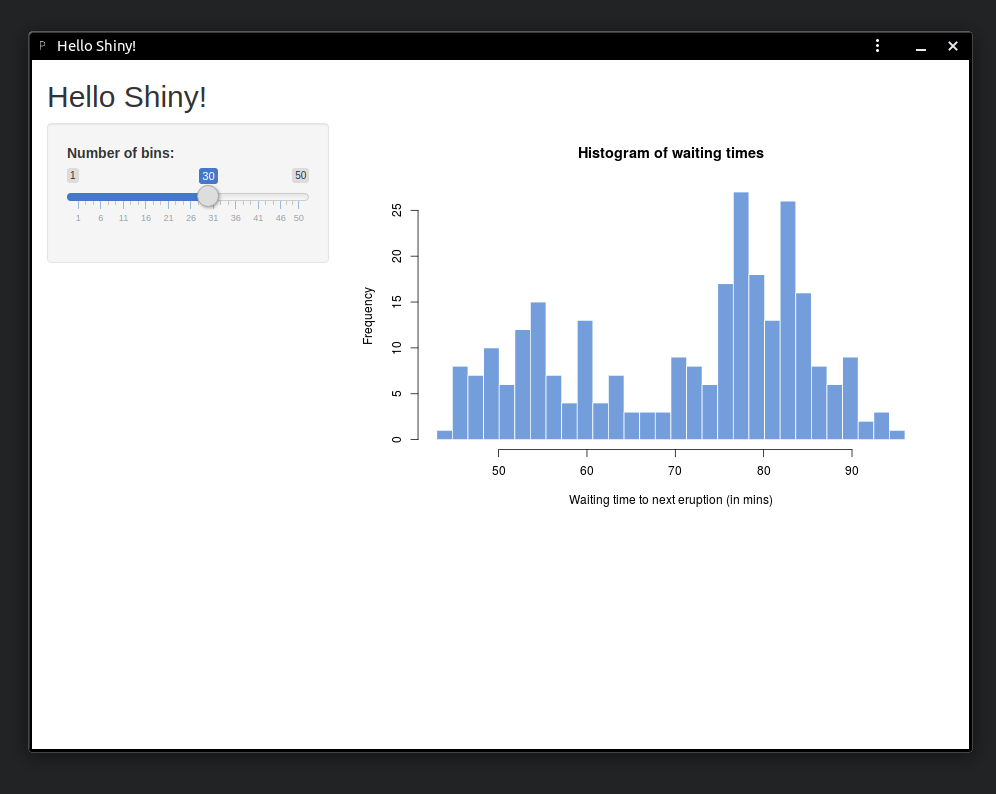

# shiny.pwa
Bring the power of Progressive web apps into your shiny dashboards! Allow users to install your dashboards allowing them to behave like a standalone application, both in desktop and mobile.

Try it out here: https://sparktuga.shinyapps.io/shinypwa/

# Usage
```
WARNING: Its important to note that PWAs are only available under the https protocol.
```

1 - Install the package from github:
```R
devtools::install_github('pedrocoutinhosilva/shiny.pwa')
```

2 - Include the library into your project:
```R
# global.R
library(shiny.pwa)
```

3 - Call the `pwa` function in your UI definition, in any place you could add ui elements (for example `mainPanel` in a `fluidPage`):
```R
# ui.R
ui <- fluidPage(
  titlePanel("Hello Shiny!"),
  sidebarLayout(
    sidebarPanel(...),
    mainPanel(
      pwa("https://myapp.com", output = "www"),
      ...
    )
  )
)
```
The following options are available:
- **domain** The URL where the app is hosted
- **title** The title of your Shiny app
- **output** The base folder used by shiny to serve static files. This is usually the www folder in your project.
- **icon** Icon Path to be used for the app. Size should be 512x512px. If left NULL a default icon is provided.
- **color** Color of the app. Used to color the browser elements when the pwa is installed.
- **offline_template** Path to the offline template you want to use. If left NULL the default template is used.
- **offline_message** When using the default offline page template, message to be displayed.

4 - If you prefer to not generate the service worker every time your app starts, you can omit the `output` attribute from the `pwa()` function and instead run `createServiceWorker(output_folder)` to generate a `pwa.service-worker.js` file. This file does not need to be added as a dependency to your UI but must be available under `https://yourapp.com/pwa.service-worker.js`. The easiest way to achieve this with shiny is to add it to your `www` folder.

4 - Thats it!

# Using PWAs
User experience depends on the OS and browser.

### Desktop
On desktop (Unix, MAC or Windows) you can use chrome to install the PWA as a standalone application. This can be done via the install button on the address bar:



It will then be available in standalone mode and show as a normal installed application:



### Mobile
On mobile you can use chrome, firefox or safari to install the PWA. On the first visit you will see a prompt for installation, on the following visits each browser has its own standards, for example chrome has the option available under "Add to home" in the right top corner options menu, firefox displays a `+` button on the address bar.


After installing the app will show and behave on your home screen as a normal mobile application.

